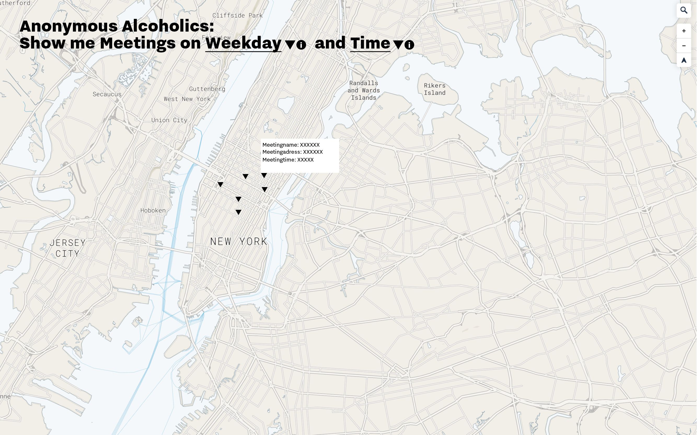
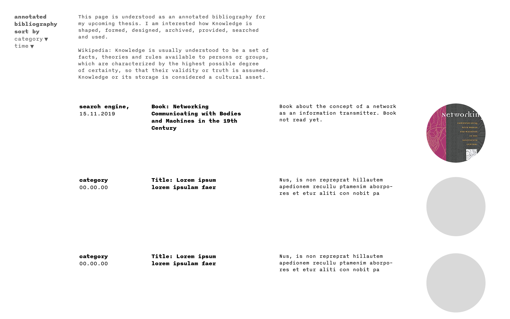
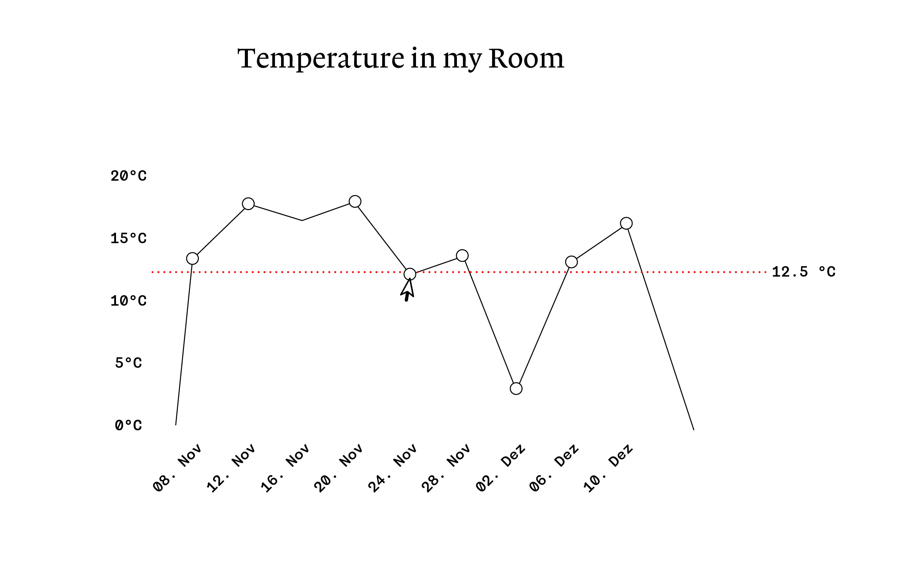

#Week 10 and 11 — Creating Interfaces
==========================

## Preparation of the final assignments

A first overview of the final assignments can be seen here: http://18.218.104.82:8080
All assignments are developed under the keyword Reliability

###AA Map

The Map shows all the AA Meetings in New York. The interface on top allows the user to filter Meetings by Time, which is the Day as well as the time of the day.
In order to gain reliable answers an info button specifies to the user what search queries are valid. Furthermore a pop up once again shows all relevant information for the user in a pop up box.
The Map is zoomable and can be panned by the User. Default view of the map is the current day with all timeslots of the day active.

###Processblog/Annotated Bibliography

The Processblog shows all interesting sources which may or may not be interesting for my 2019 Master thesis, which crossed my way in November and December. 
The sources are all categorized by categories which relate to the topic of my master thesis, the user can aggregate the sources by these categories. Furthermore the sources can be sorted by time.
The default view is a chronological order of the blog entries by time. 

###My Room Temperature/Sensordata

The visualization of my room temperature is a linegraph. It shows the average temperature of the day of one month. It is an almost static graph. A tooltip allows the user to get the exact average temperature.