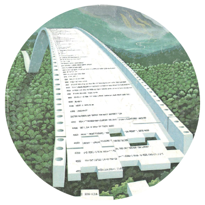

Week 2_b — Parse and Write
==========================




## Update to Week02 


As the code in week_02 generally worked, this update is in view of a parsing of all 10 files a more generalized and therefore better aproach.

```
var fs = require('fs');
var cheerio = require('cheerio');

// var base = '/home/ec2-user/environment/data-structures/01_week01/data/';
// var suffix = ['01.txt','02.txt','03.txt','04.txt','05.txt','06.txt','07.txt','08.txt','09.txt','10.txt'];


// let content_a = fs.readFileSync('/home/ec2-user/environment/data-structures/01_week01/data/01.txt');
// let content_b = fs.readFileSync('/home/ec2-user/environment/data-structures/01_week01/data/02.txt');
// let content_c = fs.readFileSync('/home/ec2-user/environment/data-structures/01_week01/data/03.txt');
// let content_d = fs.readFileSync('/home/ec2-user/environment/data-structures/01_week01/data/04.txt');
// let content_e = fs.readFileSync('/home/ec2-user/environment/data-structures/01_week01/data/05.txt');
let content_f = fs.readFileSync('/home/ec2-user/environment/data-structures/01_week01/data/06.txt');


const $ = cheerio.load(content_f);

var meetingData = [];


 $('td').each(function(i, elem) {
     if($(elem).attr("style")=="border-bottom:1px solid #e3e3e3; width:260px"){
         
         var thisMeeting = {};
         thisMeeting.streetAdress = $(elem).html().split('<br>')[2].trim().split(',')[0];
         thisMeeting.city = "NewYork";
         thisMeeting.state = "NY";
         meetingData.push(thisMeeting);
     }
 });

fs.writeFileSync('adresses_06.json', JSON.stringify(meetingData));
```

––––––––––––––––––––––––––

**illustrative image**
extract, original image made by robert tinney, 
used for BYTE magazine, 
march 1981, volume 6, number 3, 
found here: https://archive.org/details/byte-magazine-1981-03