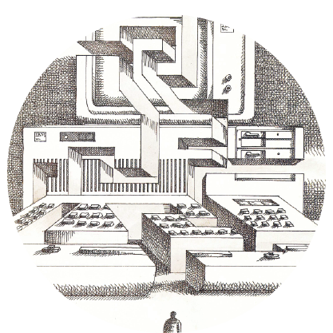
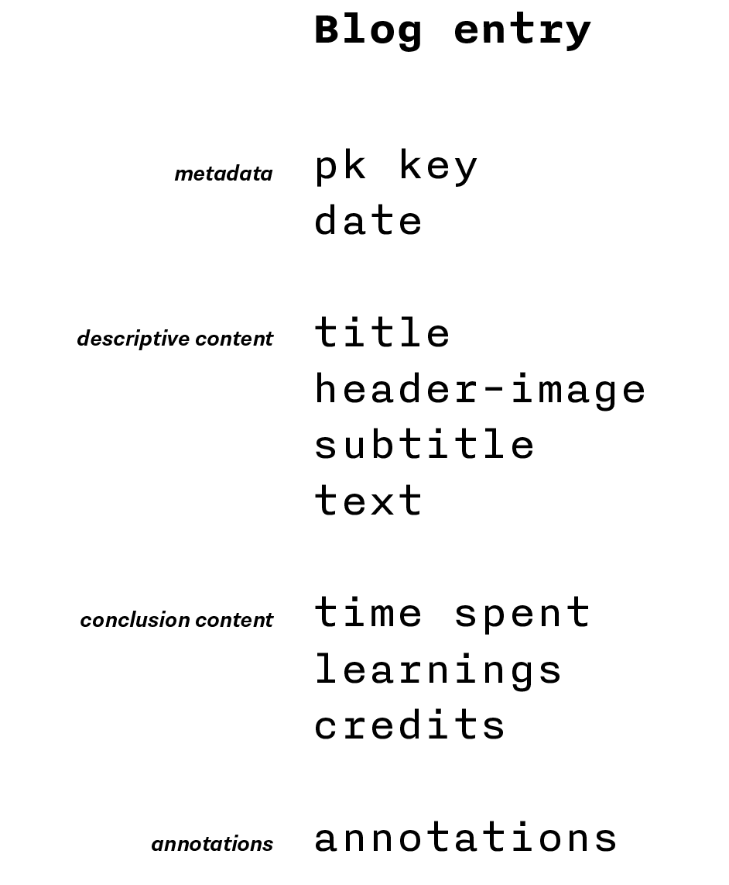
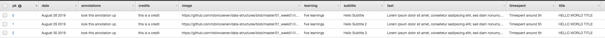

Week 4 — Creating a NoSql-Database
==========================




## A NoSql database (DynamboDB) was created in the AWS Environment. An internal aws sdk module allows to interact with the database, e.g., deleting tables, creating tables, inserting data, selecting tables/rows.

A NoSql database allows more freedom in the organisation of its structure than a sql database. The organisation of my processblog is therefore straightforward. 
I am using the structure of my github documentation. Furthermore I am adding a column called "Annotations". As the topic "data-structures", viewed from a media-cultural and socio-political perspective 
(also the Gitelman readings) are related to potential subects I am interested to research in my thesis. In the annotations column I will add whatever informations (links, literature etc.) I will find.
This processblog could then be a useful source as a startingpoint for my thesis.    \

First database concept:


Proof of Concept:


```
var blogEntries = [];
var async = require('async');

//Creating the data which will be pushed into the database

class BlogEntry {
  constructor(primaryKey, date, title, image, subtitle, text, timespent, learning, credits, annotations) {
    this.pk = {};
    this.pk.S = primaryKey;
    this.date = {}; 
    this.date.S = date;
    this.title = {};
    this.title.S = title;
    this.image = {};
    this.image.S = image;
    this.subtitle = {};
    this.subtitle.S = subtitle;
    this.text = {};
    this.text.S = text;
    this.timespent = {};
    this.timespent.S = timespent;
    this.learning = {};
    this.learning.S = learning;
    this.credits = {};
    this.credits.S = credits;
     this.annotations = {};
    this.annotations.S = annotations;
    }
   
}

//Actual Data Content

blogEntries.push(new BlogEntry("0", 'August 28 2019', 
'HELLO WORLD TITLE', 'https://github.com/robincoenen/data-structures/blob/master/01_week01/illustrative_image.png', 'Hello Subtitle',
'Lorem ipsum dolor sit amet, consetetur sadipscing elitr, sed diam nonumy eirmod tempor invidunt ut labore et dolore magna aliquyam erat, sed diam voluptua',
'Timespent around 5h',
'five learnings',
'this is a credit',
'look this annotation up'));

blogEntries.push(new BlogEntry("1", 'August 29 2019', 
'HELLO WORLD TITLE', 'https://github.com/robincoenen/data-structures/blob/master/01_week01/illustrative_image.png', 'Hello Subtitle 2',
'Lorem ipsum dolor sit amet, consetetur sadipscing elitr, sed diam nonumy eirmod tempor invidunt ut labore et dolore magna aliquyam erat, sed diam voluptua',
'Timespent around 5h',
'five learnings',
'this is a credit',
'look this annotation up'));

blogEntries.push(new BlogEntry("2", 'August 30 2019', 
'HELLO WORLD TITLE', 'https://github.com/robincoenen/data-structures/blob/master/01_week01/illustrative_image.png', 'Hello Subtitle 3',
'Lorem ipsum dolor sit amet, consetetur sadipscing elitr, sed diam nonumy eirmod tempor invidunt ut labore et dolore magna aliquyam erat, sed diam voluptua',
'Timespent around 5h',
'five learnings',
'this is a credit',
'look this annotation up'));


//Checking the actual content

//console.log(blogEntries);


//Using the AWS SDK to fill the created table
//Note -> Created IAM Role for permission, instead of a key!


var AWS = require('aws-sdk');
AWS.config = new AWS.Config();
AWS.config.region = "us-east-2";

var dynamodb = new AWS.DynamoDB();

var params = {};
// params.Item = blogEntries[0]; 

//Loop which iterates over all content (see actual content)


var i = 0 ;
    for (i=0; i < blogEntries.length; i++){
        params.Item += blogEntries[i];  
        }
params.TableName = "process";

//Pushing the items
// Note: Time out in order to avoid upload problems


async.eachSeries(blogEntries, function(value, callback) {
    params.Item = value;
    dynamodb.putItem(params, function (err, data) {
        if (err) console.log(err, err.stack); // an error occurred
        else console.log(data); // successful response
    });
    
setTimeout(callback, 2000);
}); 
```

––––––––––––––––––––––––––

**time spent**
ca. 1 day à 3 hours 
**learnings**
It seems that I, personally prefer non-relational databases, probably as I am used to think about how to organise information visually, so that users understand the information. 
**illustrative image**
original image by: Catherine Kanner, 
used for BYTE magazine, 
1985, volume 10, number 11, 
found here: https://archive.org/details/byte-magazine-1985-11
