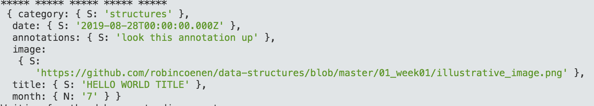
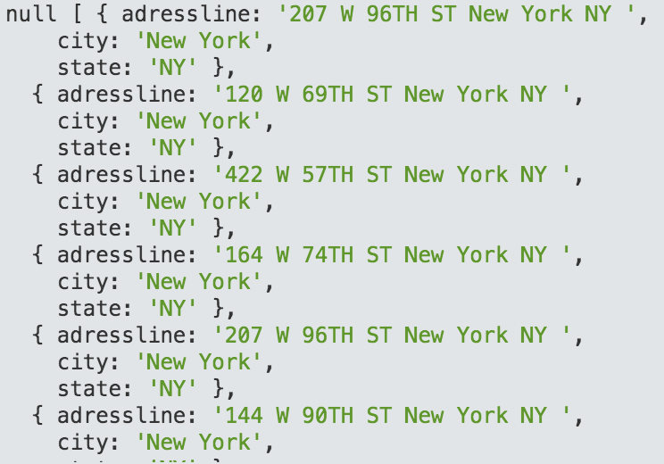

Week 6 — Sending Queries to databases 
==========================


## The purpose of databases is mainly to get data out of the database. This code shows how to extract certain wanted elements from a sql and nosql database.

When quering to a database one sees if the structure of the database is really useful — or not. After querieng I decided to change the structure of my nosql database, in order to make it more accessible and ”on point".


Proof of Concept — no sql :


Proof of Concept — sql :


The sql query extracted all data in which the City was "New York"
```
//CHECK
// Sample SQL statement to query the entire contents of a table -> SELECT * FROM
var thisQuery = "SELECT adressline, city, state FROM temploc WHERE city = 'New York';";

client.query(thisQuery, (err, res) => {
    console.log(err, res.rows);
    client.end();
});
```

The nosql is more cimplicated. Some Attributes Names are already occupied, so they have to be cleared. 
The actual query is made in the Key Condition Expression.
The query here looks for all data entries which are sorted under the category "structures" and entered between the date August 25 and 30 2019.

```
var dynamodb = new AWS.DynamoDB();

var gets = {
    TableName : "robin",
    KeyConditionExpression: "category = :topicName and #dt between :minDate and :maxDate", // the query expression
    ExpressionAttributeNames: { // name substitution, used for reserved words in DynamoDB
        "#dt" : "date"
    },
    ExpressionAttributeValues: { // the query values
        ":topicName": {S: "structures"},
        ":minDate": {S: new Date("2019-08-25").toISOString()},
        ":maxDate": {S: new Date("2019-08-30").toISOString()}
    }
};

dynamodb.query(gets, function(err, data) {
    if (err) {
        console.error("Unable to query. Error:", JSON.stringify(err, null, 2));
    } else {
        console.log("Query succeeded.");
        data.Items.forEach(function(item) {
            console.log("***** ***** ***** ***** ***** \n", item);
        });
    }
});
```


––––––––––––––––––––––––––

**time spent**
ca. 2 day à 3 hours 
**learnings**
Structures of database is essential!
**illustrative image**
original image by: Robert Tinney, 
used for BYTE magazine, 
1985, volume 08, number 03, 
found here: https://archive.org/details/byte-magazine-1983-03-rescan
