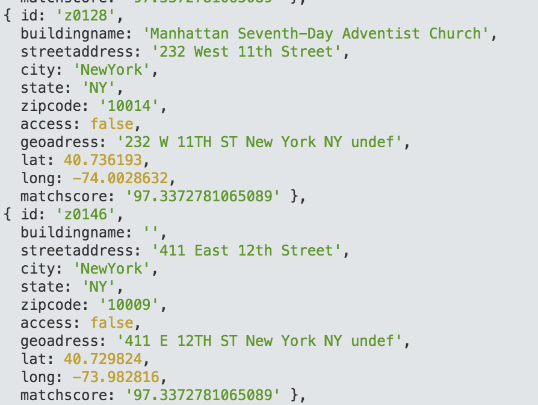
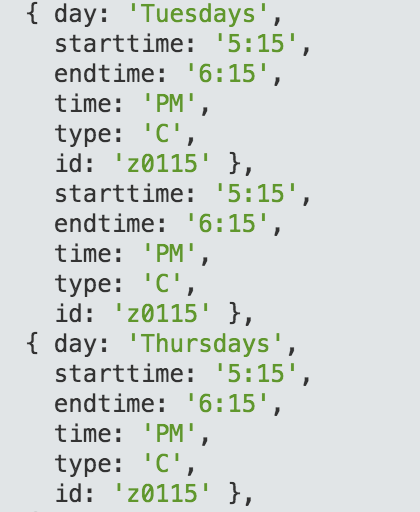

Week 7 — Cleaning all Data and upload them in a table 
==========================

Followed the steps of week 03, week04 and week05 to create a complete and clean data table.
Finally I created two tables, one contains the data about the meeting (location, geolocation and description), another about the time(weekday, starttime, endtime).

Proof of Concept — meeting (location, geolocation and description) :

Proof of Concept — time(weekday, starttime, endtime) :

––––––––––––––––––––––––––

**time spent**
in total ca. 7 days à 4 hours 
**illustrative image**
original image by: Robert Tinney, 
used for BYTE magazine, 
1984, volume 09, number 11, 
found here: https://archive.org/details/byte-magazine-1984-10-rescan
