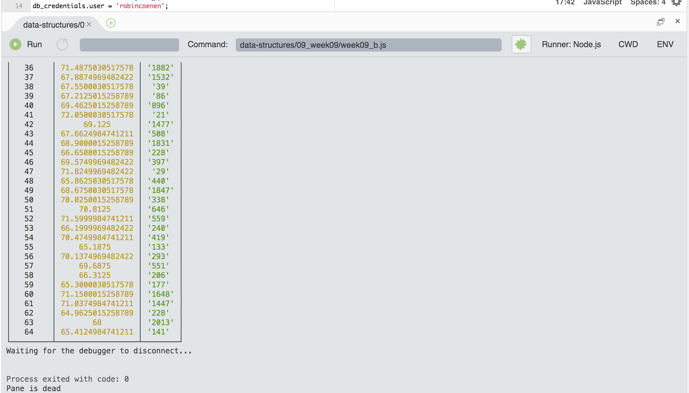

Week 9 — Measuring Live Data and putting it into a SQL Datacode
==========================

A photon particle is set up and equipped with an wifi sensor. A temperature sensor measures live data and a script running in the background makes sure that every 5 minutes this data is saved into a database.

––––––––––––––––––––––––––

**time spent**
ca. 5 days à 3 hour. 
