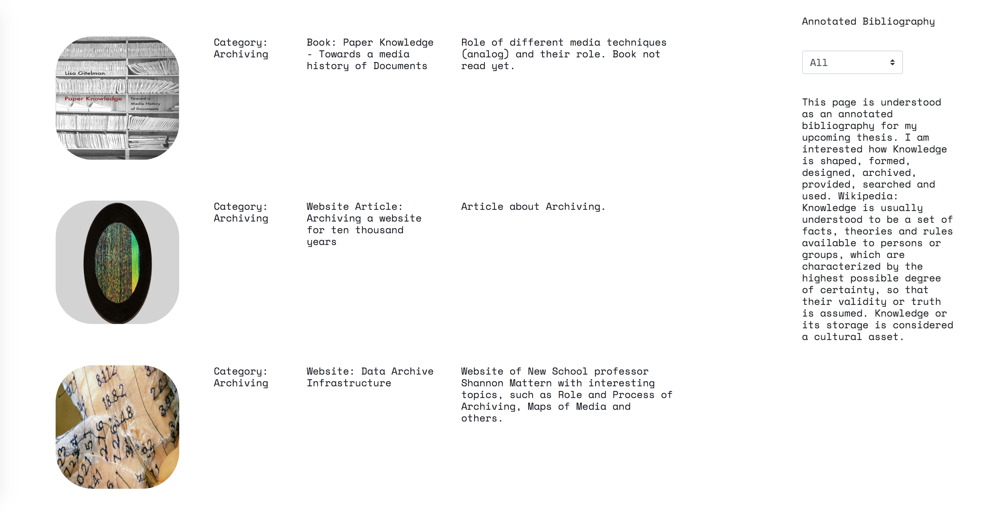
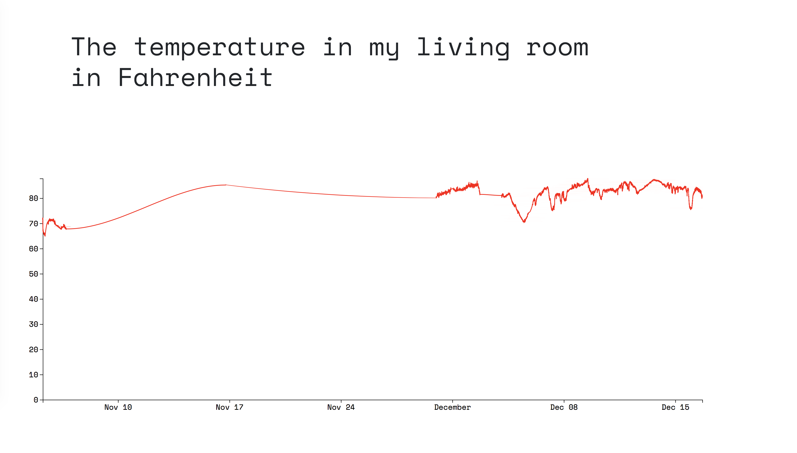
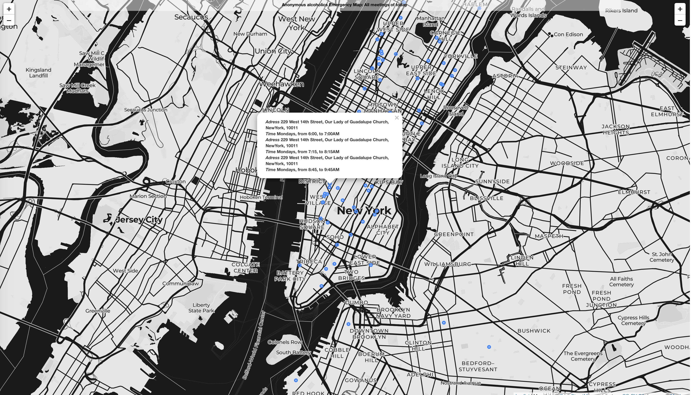
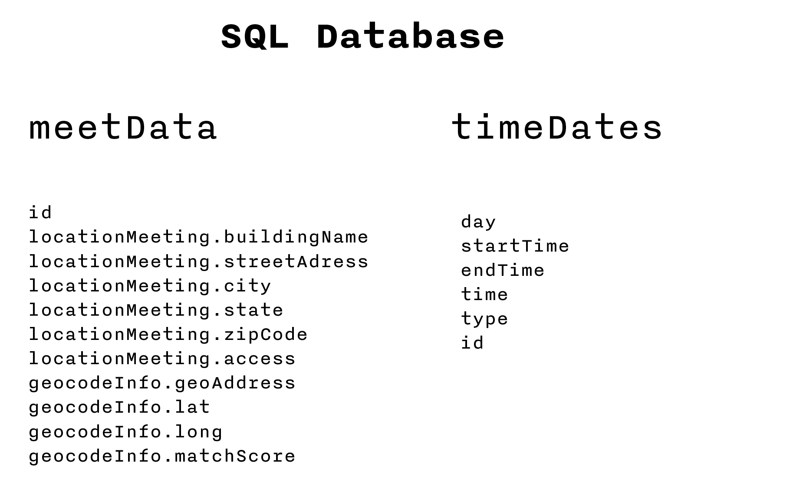

#Final Assignments 1–3
==========================

## This is the documentation of the Final Assignements of Data Structures

It consists out of 3 Final Projects:

a) A nosql process Blog as an Annotated Bibliography
b) A Graph visualizing a temperature measured by an IOT Device
c) A Map with geocoded elements and contextual information which was scraped 

### a) Annotated Bibliography 

Visit here: http://18.218.104.82:8080/a_blog.html

The Processblog shows all interesting sources which may or may not be interesting for my 2019 Master thesis, which crossed my way in November and December. 
 

The data of the annotated bibliography is stored in a no-sql Database (Dynamo DB in Amazon AWS). 
In the previous weeks I re-did the structure of this database several times, in order to achieve a most effective structure of elements.
Even after redoing the structure several times, after working with the final product I always find ways to improve the structure. 
For example should the URL of my source be a own column in the table, so that its more accessible.

The data is queried in the app.js file. By default all entries are shown via the scan function of dynamo db. 
However when the user decides to filter all entries by a certain category via the Frontend, the query in the background filters the output accordingly. 
A pipeline between the app.js, an ajax and jquery javascript, an html file as well as a css file accomplish the final product of the processblog.

The filter button as well as the blogdescription is always visible, as it is sticky. That allows the user to always understand the context of the webpage.

### b) The Temperature in my living room

Visit here: http://18.218.104.82:8080/b_sensor.html

Using a particle temperature sensor equipped with an internet access allowed to measure the temperature of my living room every two minutes. 
The measured data was then stored in a sql database. A pm2 instance was used as a process manager to make sure the data was stored automatically.
Unfortanately I wasnt aware that my data wasnt stored between the 10 November and Beginning of December. I uncounsciously stopped the pm2 process 
and just realized it at the beginning of december.\
In order to create a line graph out of the recorded data it was  queried out of the sql database.
This query was then inserted into as data (temperature and time) into an d.3 linegraph.
As it is a lot of data which is fetched from sql and then transformed via d3 into an visual representation as a svg, it takes a moment until the svg loads.
THere might be a more effective way, in terms of speed, to achieve this.

### c) Anonymous Alcoholics: Emergency Map

Visit here: http://18.218.104.82:8080/aaData

The data represented on the map depicts data which was scraped from html webpages which listed meetings of anonymous alcoholics meetings.
This data was then geocoded by its given adresses and then stored in an sql database. 
In this process I created two tables, one contained everything which I thought important for the nature of each meeting and the other table for the 
timing of each meeting:

When querying this data in order to represent it on a map it was necessary to connect these two tables. 
I achieved it by creating a virtual temporarily third table in which the two real tables were joined on their same id. 
While structuring the data I gave each Time, even if it was at the exact same "meeting nature" parameters, an own id. 
This effect can also be seen in the popups of the Map. It means that each adress is repeated for each time. 
This means some some visual redudancy but at the same time this redudancy increases the reliability and delivers adresses, 
even if one data endpoint is not reacting for whatever reason.\
The concept of the map is one of an "emergency map". 
That means I am using moment.js in order to reduce the items which appear on the map only on the very day the user visits the website.
If the user is in need and needs a meeting at this very moment, he does not have to click through many offers, but knows that everything which will be shown there,
is valid data for him/her. 
This approach also reduces the amount of data to load onto the map and increases the speed. 

 Data Structures, 2019 — Robin Coenen \
 Taught by Aaron Hill \
 Thanks to Marisa, Neil and Saloni for their help and support 

