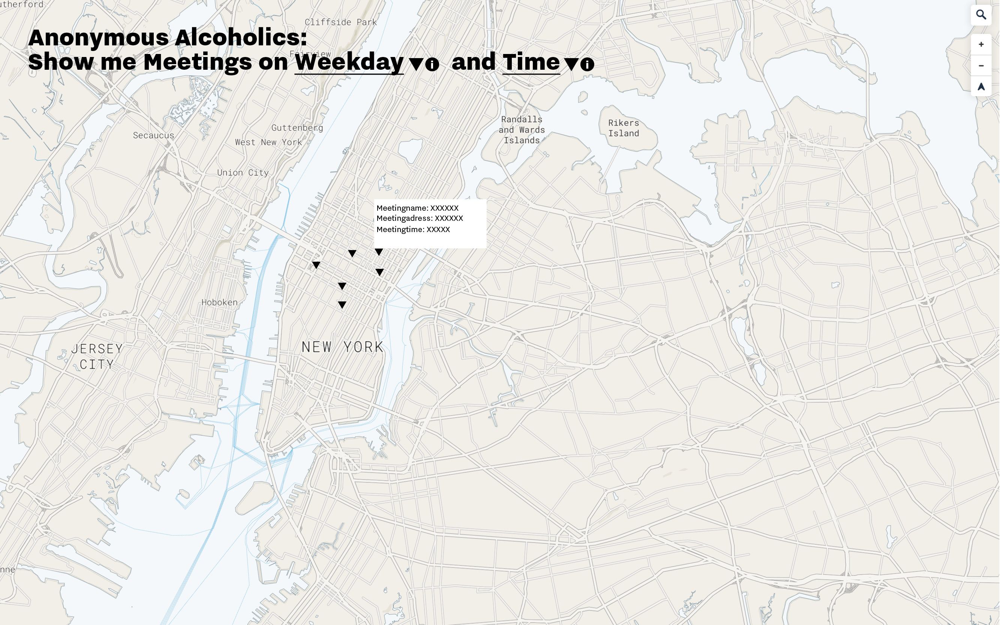
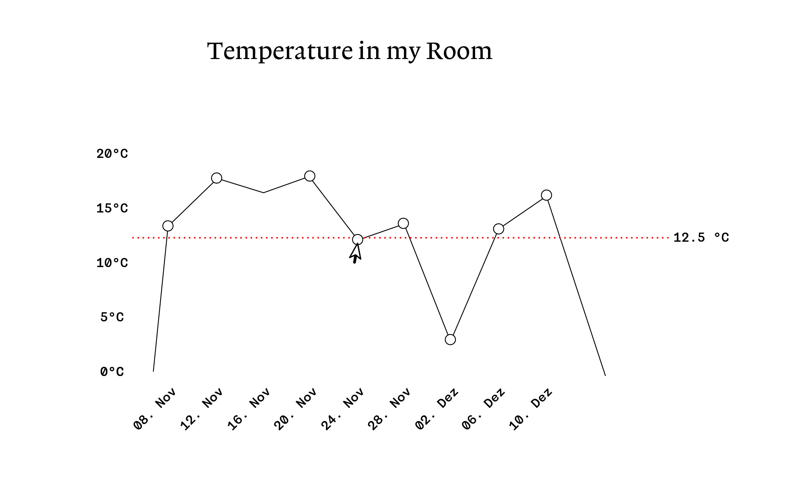

#Final Assignments 1–3
==========================

## This is the documentation of the Final Assignements of Data Structures

It consists out of 3 Final Projects:

a) A nosql process Blog as an Annotated Bibliography
b) A Graph visualizing a temperature measured by an IOT Device
c) A Map with geocoded elements and contextual information which was scraped 

### a) Annotated Bibliography 

The Processblog shows all interesting sources which may or may not be interesting for my 2019 Master thesis, which crossed my way in November and December. 
 

The data of the annotated bibliography is stored in a no-sql Database (Dynamo DB in Amazon AWS). 
In the previous weeks I re-did the structure of this database several times, in order to achieve a most effective structure of elements.
Even after redoing the structure several times, after working with the final product I always find ways to improve the structure. 
For example should the URL of my source be a own column in the table, so that its more accesible.

### b) The Temperature in my living room

The Processblog shows all interesting sources which may or may not be interesting for my 2019 Master thesis, which crossed my way in November and December. 
The sources are all categorized by categories which relate to the topic of my master thesis, the user can aggregate the sources by these categories. Furthermore the sources can be sorted by time.
The default view is a chronological order of the blog entries by time. 

### c) Anonymous Alcoholics: Emergency Map

The visualization of my room temperature is a linegraph. It shows the average temperature of the day of one month. It is an almost static graph. A tooltip allows the user to get the exact average temperature.